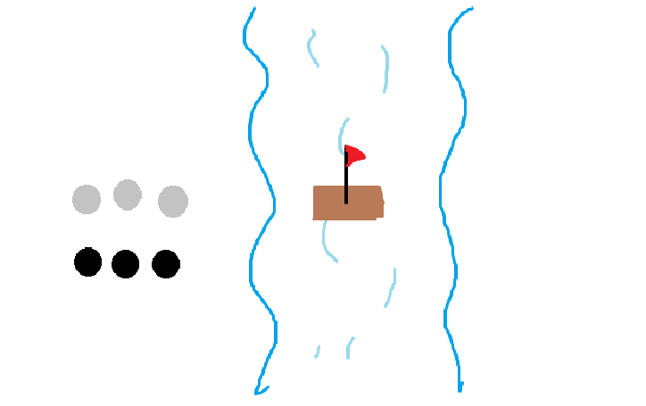

# Inteligencia Artificial

**Alumno:** Hernández Astorga Francisco Ricardo

**Expediente:** 223219591

**Semestre:** 6°

Repositorio de notas personales para la materia de **Inteligencia Artificial**.

## Clase – 12/01/2026

**¿Qué es la Inteligencia Artificial?**

Es un sistema/herramienta que imita la inteligencia y razonamiento humano para llevar a cabo la resolucion de problemas.  
Un punto interesante es cuestionar si es correcto que la IA imite únicamente la inteligencia humana.

> "Maximizar la esperanza (*expectation*) de una utilidad futura".

## Clase – 13/01/2026

**PEAS (Performance, Entorno, Actuadores, Sensores)**

PEAS es un marco de referencia para describir una tarea desde el punto de vista de un **agente inteligente**.

Permite identificar:
- **Performance (Desempeño):** qué tan bien realiza la tarea el agente.
- **Environment (Entorno):** el mundo en el que opera el agente.
- **Actuators (Actuadores):** cómo el agente actúa sobre el entorno.
- **Sensors (Sensores):** cómo el agente percibe el entorno.

Durante la clase nos enfocamos principalmente en la parte de **sensores**, analizando cómo la información disponible condiciona las decisiones del agente.

---

**Ejemplo 1: Torres de Hanoi**

En este ejemplo, analizamos los posibles estados que tiene el juego de torres de Hanoi.  

    

Donde como se ve en la imagen, se tienen 5 discos, uno cada vez mas grande que el anterior y deben colocarse en otra de las torres siguiendo las condiciones
y esto nos queda de la siguiente manera:  
S = [S₁, S₂, S₃, S₄, S₅]  
Sᵢ ∈ {A, B, C}  
|S| = 3⁵

---

**Ejemplo 2: 3 esclavistas y 3 trabajadores sin paga cruzando un río**

En este problema se ve reflejado que aunque haya menos combinaciones, es mas complejo debido a las rutas posibles.  

  

Aqui los estados serian el numero de esclavistas de un lado del rio, el numero de trabajadores sin paga de un lado del rio y el lado del rio, dandonos la operacion de 4 x 4 x 2, dando un total de `32` estados.

## Clase – 14/01/2026

**Propiedades del entorno**

- **Estático:** El entorno no cambia si el agente no actúa. Es como resolver un crucigrama; el papel no va a cambiar de lugar ni las letras se van a mover mientras decides qué escribir.  
- **Dinámico:** El entorno cambia constantemente, incluso si el agente se queda quieto. Como jugar al fútbol o conducir un coche: si te detienes a pensar demasiado, la situación a tu alrededor ya es otra.  
- **Discreto:** Hay un número finito y bien definido de posibilidades. En el ajedrez, las casillas están numeradas (A1, B2) y los turnos son claros. No hay un "punto medio" entre la casilla A1 y la A2.  
- **Continuo:** Las variables fluyen sin saltos, como el tiempo, la velocidad o la posición exacta. Un robot que camina opera en un entorno continuo porque su ángulo de pierna puede ser `30°`, `30.1°`, `30.001°`, etc.  
- **Totalmente Observable:** El agente tiene acceso a toda la información necesaria para tomar una decisión. Ejemplo: El ajedrez (ves todo el tablero).  
- **Parcialmente Observable:** El agente solo ve una parte. Ejemplo: El póker (no ves las cartas de los demás) o conducir (no sabes qué hay a la vuelta de la esquina).  
- **No Observable:** El agente no tiene sensores o no puede percibir nada del entorno. Básicamente, actúa a ciegas.  
- **Determinista:** Si haces una acción, el resultado siempre será el mismo. Si en un videojuego mueves una pieza a la derecha, siempre termina a la derecha. No hay azar.  
- **Estocástico:** Hay incertidumbre o azar. Aunque tú hagas lo mismo, el resultado puede variar. Ejemplo: Tirar un dado o el clima; hay una probabilidad, pero no una certeza absoluta.
- **Episódico:** Cada acción es independiente. Como una IA que clasifica fotos: si clasifica mal una foto de un gato, eso no afecta en nada su capacidad para clasificar la siguiente foto de un perro.
- **Secuencial:** Lo que hagas ahora afectará lo que pase después. En un juego de estrategia, si pierdes a tu mejor unidad al principio, esa decisión "te persigue" durante el resto de la partida.

**Propiedades del Entorno y Funciones de Transición**

Tambien vimos ejemplos de como se representarian algunas propiedades de entorno, ejemplos como los siguientes:

**1. Entorno Estático, Determinista, Observable, Discreto.**  
**Fórmula:** $S = f(a)$  
El estado final depende única y exclusivamente de la acción realizada. El entorno no cambia por sí solo y no importa el historial previo.  
Un ejemplo podria ser un conversor de unidades, como podria ser de Celsius a Fahrenheit. Si la acción es ingresar `100`, el estado de salida siempre será `212`. No importa qué número convertiste antes ni cuánto tiempo esperes.

**2. Entorno Dinámico, Determinista, Observable, Discreto.**  
**Fórmula:** $S_{k+1} = f(S_k, a_k)$  
El entorno evoluciona. El siguiente estado ($S_{k+1}$) es el resultado de aplicar una acción ($a_k$) sobre el estado actual ($S_k$). Aquí el "pasado" inmediato o la situación actual es crítica.  
En el ajedrez, para saber cómo quedará el tablero (nuevo estado), necesitas saber cómo estaban las piezas antes (estado actual) y qué movimiento hiciste (acción).

**3. Entorno Estocástico, Estatico, Discreto)**  
**Fórmula:** $S = (S^1, ... , S^m)$ donde $m$ es la cardinalidad de $S$.  
$Pr[S | a]$ = $[Pr[S = s^1 | a], ... , Pr[S = s^m | a]]$  
Esto es cuando no hay certeza absoluta. La misma acción en el mismo estado puede llevar a resultados diferentes debido al azar o a variables desconocidas.  
Un ejemplo podria ser lanzar un dado. El estado inicial es el dado en tu mano ($S$), la acción es lanzar ($a$), pero el estado final es incierto, tienes una probabilidad de $1/6$ para cada cara. Aunque el entorno sea estático (el dado no cambia de cara mientras piensas), el resultado de la acción es aleatorio.

## Clase – 15/01/2026

notas
