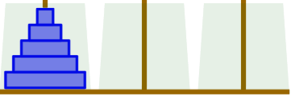
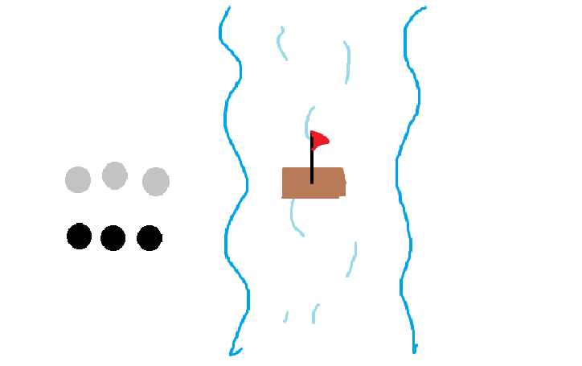

# **Primer parcial: Inteligencia Artificial**

**Alumno:** Hernández Astorga Francisco Ricardo

**Expediente:** 223219591

**Semestre:** 6°

Repositorio de notas personales para la materia de **Inteligencia Artificial**.

## **Clase – 12/01/2026**

**¿Qué es la Inteligencia Artificial?**

Es un sistema/herramienta que imita la inteligencia y razonamiento humano para llevar a cabo la resolucion de problemas.  
Un punto interesante es cuestionar si es correcto que la IA imite únicamente la inteligencia humana.

> "Maximizar la esperanza (*expectation*) de una utilidad futura".

## **Clase – 13/01/2026**

**PEAS (Performance, Entorno, Actuadores, Sensores)**

PEAS es un marco de referencia para describir una tarea desde el punto de vista de un **agente inteligente**.

Permite identificar:
- **Performance (Desempeño):** qué tan bien realiza la tarea el agente.
- **Environment (Entorno):** el mundo en el que opera el agente.
- **Actuators (Actuadores):** cómo el agente actúa sobre el entorno.
- **Sensors (Sensores):** cómo el agente percibe el entorno.

Durante la clase nos enfocamos principalmente en la parte de **sensores**, analizando cómo la información disponible condiciona las decisiones del agente.

---

**Ejemplo 1: Torres de Hanoi**

En este ejemplo, analizamos los posibles estados que tiene el juego de torres de Hanoi.  

    

Donde como se ve en la imagen, se tienen 5 discos, uno cada vez mas grande que el anterior y deben colocarse en otra de las torres siguiendo las condiciones
y esto nos queda de la siguiente manera:  
S = [S₁, S₂, S₃, S₄, S₅]  
Sᵢ ∈ {A, B, C}  
|S| = 3⁵

---

**Ejemplo 2: 3 esclavistas y 3 trabajadores sin paga cruzando un río**

En este problema se ve reflejado que aunque haya menos combinaciones, es mas complejo debido a las rutas posibles.  

  

Aqui los estados serian el numero de esclavistas de un lado del rio, el numero de trabajadores sin paga de un lado del rio y el lado del rio, dandonos la operacion de 4 x 4 x 2, dando un total de `32` estados.

## **Clase – 14/01/2026**

**Propiedades del entorno**

- **Estático:** El entorno no cambia si el agente no actúa. Es como resolver un crucigrama; el papel no va a cambiar de lugar ni las letras se van a mover mientras decides qué escribir.  
- **Dinámico:** El entorno cambia constantemente, incluso si el agente se queda quieto. Como jugar al fútbol o conducir un coche: si te detienes a pensar demasiado, la situación a tu alrededor ya es otra.  
- **Discreto:** Hay un número finito y bien definido de posibilidades. En el ajedrez, las casillas están numeradas (A1, B2) y los turnos son claros. No hay un "punto medio" entre la casilla A1 y la A2.  
- **Continuo:** Las variables fluyen sin saltos, como el tiempo, la velocidad o la posición exacta. Un robot que camina opera en un entorno continuo porque su ángulo de pierna puede ser `30°`, `30.1°`, `30.001°`, etc.  
- **Totalmente Observable:** El agente tiene acceso a toda la información necesaria para tomar una decisión. Ejemplo: El ajedrez (ves todo el tablero).  
- **Parcialmente Observable:** El agente solo ve una parte. Ejemplo: El póker (no ves las cartas de los demás) o conducir (no sabes qué hay a la vuelta de la esquina).  
- **No Observable:** El agente no tiene sensores o no puede percibir nada del entorno. Básicamente, actúa a ciegas.  
- **Determinista:** Si haces una acción, el resultado siempre será el mismo. Si en un videojuego mueves una pieza a la derecha, siempre termina a la derecha. No hay azar.  
- **Estocástico:** Hay incertidumbre o azar. Aunque tú hagas lo mismo, el resultado puede variar. Ejemplo: Tirar un dado o el clima; hay una probabilidad, pero no una certeza absoluta.
- **Episódico:** Cada acción es independiente. Como una IA que clasifica fotos: si clasifica mal una foto de un gato, eso no afecta en nada su capacidad para clasificar la siguiente foto de un perro.
- **Secuencial:** Lo que hagas ahora afectará lo que pase después. En un juego de estrategia, si pierdes a tu mejor unidad al principio, esa decisión "te persigue" durante el resto de la partida.

**Propiedades del Entorno y Funciones de Transición**

Tambien vimos ejemplos de como se representarian algunas propiedades de entorno, ejemplos como los siguientes:

**1. Entorno Estático, Determinista, Observable, Discreto.**  
**Fórmula:** $S = f(a)$  
El estado final depende única y exclusivamente de la acción realizada. El entorno no cambia por sí solo y no importa el historial previo.  
Un ejemplo podria ser un conversor de unidades, como podria ser de Celsius a Fahrenheit. Si la acción es ingresar `100`, el estado de salida siempre será `212`. No importa qué número convertiste antes ni cuánto tiempo esperes.

**2. Entorno Dinámico, Determinista, Observable, Discreto.**  
**Fórmula:** $S_{k+1} = f(S_k, a_k)$  
El entorno evoluciona. El siguiente estado ($S_{k+1}$) es el resultado de aplicar una acción ($a_k$) sobre el estado actual ($S_k$). Aquí el "pasado" inmediato o la situación actual es crítica.  
En el ajedrez, para saber cómo quedará el tablero (nuevo estado), necesitas saber cómo estaban las piezas antes (estado actual) y qué movimiento hiciste (acción).

**3. Entorno Estocástico, Estatico, Discreto)**  
**Fórmula:** $S = (S^1, ... , S^m)$ donde $m$ es la cardinalidad de $S$.  
$Pr[S | a]$ = $[Pr[S = s^1 | a], ... , Pr[S = s^m | a]]$  
Esto es cuando no hay certeza absoluta. La misma acción en el mismo estado puede llevar a resultados diferentes debido al azar o a variables desconocidas.  
Un ejemplo podria ser lanzar un dado. El estado inicial es el dado en tu mano ($S$), la acción es lanzar ($a$), pero el estado final es incierto, tienes una probabilidad de $1/6$ para cada cara. Aunque el entorno sea estático (el dado no cambia de cara mientras piensas), el resultado de la acción es aleatorio.

## **Clase – 15/01/2026**

En la clase de hoy profundizamos en la estructura de los agentes y cómo interactúan con su entorno.

**¿Qué es un Agente?**  
Un **agente** es cualquier entidad que percibe su **entorno** a través de **sensores** y actúa sobre él mediante **actuadores**.

* **Percepciones:** Se refiere al contenido que los sensores del agente están recibiendo en un momento dado.
* **Función del Agente:** Es la descripción matemática que mapea cualquier secuencia de percepciones con una acción ($act = AgentFn(percept)$).
* **Programa del Agente:** Es la implementación real y física de la función del agente que corre sobre una arquitectura específica.

**Ejemplo: El Mundo de la Aspiradora**  
Analizamos un modelo simplificado donde un robot opera en un entorno con dos localizaciones, **A** y **B**.

* **Percepciones:** El agente percibe su ubicación actual y si hay suciedad (ej. `[A, Sucio]`).
* **Acciones:** El agente puede decidir entre `Izquierda`, `Derecha`, `Succionar` o `NoOp` (no hacer nada).

**Racionalidad y Desempeño**  
Un agente inteligente no es necesariamente perfecto u omnisciente, sino que busca ser **racional**, como hablamos en clases anteriores.

* **Medida de desempeño:** Es el criterio objetivo que evalúa qué tan exitosa es una secuencia de estados en el entorno (ej. ganar puntos por cada cuadro limpio).
* **Agente Racional:** Es aquel que elige la acción que maximiza el valor esperado de su medida de desempeño, basándose en su secuencia de percepciones y su conocimiento previo.
* **Diferencia clave:** La racionalidad no es igual a la perfección, un agente racional puede fallar si la información es incompleta, pero su decisión sigue siendo la mejor posible con los datos que tenía.

**Tipos de Agentes**  
Dependiendo de la complejidad de su "cerebro", clasificamos a los agentes en:

1. **Agentes de Reflejo Simple:** Toma decisiones basándose únicamente en lo que percibe en este preciso instante ("Si veo X, hago Y"). Ignora todo lo que pasó antes.
    $a = f(p)$
2. **Agentes basados en el historial:** Toma decisiones considerando toda la secuencia de cosas que ha percibido desde que se encendió, no solo la actual.
   $a = f([p_1, p_2, \dots, p_n])$
3. **Agentes basados en modelos:** Mantiene un "estado interno" (una memoria) para rastrear aspectos del mundo que no puede ver en este momento. Sabe cómo cambia el mundo por sí solo y cómo lo afectan sus acciones.
   $a = f_m(p)$
4. **Agentes basados en metas:** No solo reacciona, sino que planea. Tiene un objetivo claro (meta) y busca la secuencia de acciones necesaria para alcanzarlo.
   $a = f_m(p, s)$
5. **Agentes basados en utilidad:** Va un paso más allá de las metas. No solo quiere llegar al objetivo, sino hacerlo de la mejor manera posible (más rápido, más seguro, más barato). Maximiza una medida de "felicidad" o utilidad.
   $a = f_m(p, s)$

## **Clase – 16/01/2026**

En esta clase nos enfocamos mas en como trasncurriria el curso, viendo el siguiente cronograma:


Tabien vimos los distintos tipos de agentes que veriamos en el curso:

| Agentes reactivos| Agentes basados en metas | Modelos basados en utilidad | 
| :--- | :--- | :--- |
| Estocasticos, Discretos, Observable, Deterministas| Dinamico, Discretos, Observable, Deterministas | Estocasticos |

Y por ultimo vimos los criterios de evalucion:

**Actividades de evaluación continua (notas):** 10%  

**Actividades de evaluación de conocimientos (problemarios):** 30%  

**Actividades de evaluación de competencias (laboratorios):** 30%  

**Exámenes:** 30%

Donde se menciono que se necesita el **60%** minimo, en las actividades de evalucion de competencias para aprobar el curso.

## **Clase – 19/01/2026**

En esta clase profundizamos mas sobre el entorno, donde vimos que:

$S = Estado$  
$S = (S_1, . . ., S_n) \in D_1 x . . x D_n = S$  
$a_t \in A = (a_1, . . ., a_m)$  
$a_t \in A(s_t)$ acciones legales  
$p_t \in \rho$ espacio de percepciones  
$p_t = percepción(S_t)$        
$percepción: S \rightarrow \rho$  
$S_{t + 1} = transición(S_t, a_t)$  
$c = costo(s_t, a_t, S_{t + 1})$

Y analizamos y discutimos el codigo `doscuartos_o.py` y `doscuartos_f.py`. 

```
#!/usr/bin/env python
# -*- coding: utf-8 -*-

"""
doscuartos_f.py
----------------

Ejemplo de un entorno muy simple y agentes idem

"""

import entornos_f
from random import choice


__author__ = 'juliowaissman'


class DosCuartos(entornos_f.Entorno):
    """
    Clase para un entorno de dos cuartos.
    Muy sencilla solo regrupa métodos.

    El estado se define como (robot, A, B)
    donde robot puede tener los valores "A", "B"
    A y B pueden tener los valores "limpio", "sucio"

    Las acciones válidas en el entorno son
        ("ir_A", "ir_B", "limpiar", "nada").

    Todas las acciones son válidas en todos los estados.

    Los sensores es una tupla (robot, limpio?)
    con la ubicación del robot y el estado de limpieza

    """
    def accion_legal(self, _, accion):
        return accion in ("ir_A", "ir_B", "limpiar", "nada")

    def transicion(self, estado, acción):
        robot, a, b = estado

        c_local = 0 if a == b == "limpio" and acción == "nada" else 1

        return ((estado, c_local) if a == "nada" else
                (("A", a, b), c_local) if acción == "ir_A" else
                (("B", a, b), c_local) if acción == "ir_B" else
                ((robot, "limpio", b), c_local) if robot == "A" else
                ((robot, a, "limpio"), c_local))

    def percepcion(self, estado):
        return estado[0], estado[" AB".find(estado[0])]


class AgenteAleatorio(entornos_f.Agente):
    """
    Un agente que solo regresa una accion al azar entre las acciones legales

    """
    def __init__(self, acciones):
        self.acciones = acciones

    def programa(self, _):
        return choice(self.acciones)


class AgenteReactivoDoscuartos(entornos_f.Agente):
    """
    Un agente reactivo simple

    """
    def programa(self, percepcion):
        robot, situacion = percepcion
        return ('limpiar' if situacion == 'sucio' else
                'ir_A' if robot == 'B' else 
                'ir_B')


class AgenteReactivoModeloDosCuartos(entornos_f.Agente):
    """
    Un agente reactivo basado en modelo

    """
    def __init__(self):
        """
        Inicializa el modelo interno en el peor de los casos

        """
        self.modelo = ['A', 'sucio', 'sucio']

    def programa(self, percepción):
        robot, situación = percepción

        # Actualiza el modelo interno
        self.modelo[0] = robot
        self.modelo[' AB'.find(robot)] = situación

        # Decide sobre el modelo interno
        a, b = self.modelo[1], self.modelo[2]
        return ('nada' if a == b == 'limpio' else
                'limpiar' if situación == 'sucio' else
                'ir_A' if robot == 'B' else 'ir_B')


def prueba_agente(agente):
    entornos_f.imprime_simulacion(
        entornos_f.simulador(
            DosCuartos(),
            agente,
            ["A", "sucio", "sucio"],
            100
        ),
        ["A", "sucio", "sucio"]
    )

def test():
    """
    Prueba del entorno y los agentes

    """
    print("Prueba del entorno con un agente aleatorio")
    prueba_agente(AgenteAleatorio(['ir_A', 'ir_B', 'limpiar', 'nada']))

    print("Prueba del entorno con un agente reactivo")
    prueba_agente(AgenteReactivoDoscuartos())

    print("Prueba del entorno con un agente reactivo con modelo")
    prueba_agente(AgenteReactivoModeloDosCuartos())
    

if __name__ == "__main__":
    test()
```

## **Clase – 20/01/2026**
> A partir de esta fecha, una parte de las notas esta hecha con IA.

En esta clase recalcamos mas la definición de Agente y Entorno.
   
Un **agente** es cualquier entidad que percibe su entorno y actúa sobre él.
* **Sensores:** Mecanismos para recibir información del entorno (percepciones).
* **Actuadores:** Mecanismos para operar o modificar el entorno (acciones).
* **Percepción:** El contenido de lo que captan los sensores en un instante específico.
* **Secuencia de Percepciones:** El historial completo de todo lo percibido por el agente hasta la fecha.

> **La Función del Agente:** Matemáticamente, el comportamiento del agente se describe como una función que mapea una secuencia de percepciones a una acción:
> $$f : P^* \rightarrow A$$

El Concepto de Racionalidad
   
Un agente racional es aquel que elige la acción que **maximiza su medida de rendimiento esperada**, dada la evidencia aportada por la secuencia de percepciones y su conocimiento incorporado.

La racionalidad depende de 4 factores:
1.  **Medida de Rendimiento:** El criterio objetivo de éxito (¿qué queremos lograr?).
2.  **Conocimiento del Entorno:** Lo que el agente ya sabe sobre el medio.
3.  **Acciones:** Lo que el agente es capaz de hacer.
4.  **Secuencia de Percepciones:** Lo que el agente ha "visto" hasta ahora.

**Importante:** Racionalidad $\neq$ Omnisciencia. La racionalidad se basa en el *rendimiento esperado* (lo mejor que puedes hacer con lo que sabes), no en el resultado perfecto (que requeriría conocer el futuro).

Especificación del Entorno (REAS).
   
Para diseñar un agente, debemos definir primero el **Entorno de Trabajo**. Usamos el acrónimo **REAS** (en inglés PEAS).

| Sigla | Concepto | Definición en Apuntes |
| :--- | :--- | :--- |
| **R** | **R**endimiento (Performance) | ¿Cómo medimos el éxito? |
| **E** | **E**ntorno (Environment) | ¿En dónde opera el agente? |
| **A** | **A**ctuadores (Actuators) | ¿Con qué actúa el agente? |
| **S** | **S**ensores (Sensors) | ¿Con qué percibe el agente? |

Ejemplo: Sistema de Diagnóstico Médico.

* **Rendimiento:** Pacientes sanos, minimizar costos, evitar demandas.
* **Entorno:** Paciente, hospital, personal médico.
* **Actuadores:** Pantalla (preguntas/diagnósticos), derivaciones, recetas.
* **Sensores:** Teclado (entrada de síntomas), historial médico digital.

4. Tipos de Entornos.
   
Las propiedades del entorno determinan la dificultad del diseño del agente:

* **Totalmente Observable vs. Parcialmente Observable:** ¿Los sensores detectan todo el estado relevante del mundo?
* **Determinista vs. Estocástico:** ¿El siguiente estado del entorno está determinado completamente por el estado actual y la acción? (Si hay azar, es estocástico).
* **Episódico vs. Secuencial:** ¿La experiencia se divide en episodios independientes (como clasificar imágenes) o cada decisión afecta a las futuras (como ajedrez)?
* **Estático vs. Dinámico:** ¿El entorno cambia mientras el agente está "pensando"?
* **Discreto vs. Continuo:** ¿Hay un número finito de estados/acciones o son magnitudes continuas?
* **Agente Individual vs. Multiagente:** ¿Hay otros agentes actuando en el entorno?

Estructura de los Agentes.

El **Programa del Agente** implementa la función del agente ($f$) en una arquitectura física.
Existen 4 tipos básicos de programas:

1.  **Agentes Reactivos Simples:** Responden directamente a la percepción actual (reglas *condición-acción*). No tienen memoria.
2.  **Agentes Reactivos Basados en Modelos:** Mantienen un *estado interno* para rastrear partes del mundo que no pueden ver ahora mismo.
3.  **Agentes Basados en Objetivos (Metas):** Utilizan información sobre un "estado deseado" para planificar sus acciones.
4.  **Agentes Basados en Utilidad:** Tienen una "función de utilidad" interna que les permite preferir estados más felices/útiles sobre otros (útil cuando hay objetivos conflictivos).

## **Clase – 21/01/2026**

Formulación del Problema de Aprendizaje.

El aprendizaje supervisado se formaliza matemáticamente con los siguientes componentes:

* **Función Objetivo ($f$):** Es la función "verdadera" que queremos descubrir.
    * Mapea entradas a salidas: $f: \mathcal{X} \rightarrow \mathcal{Y}$.
    * **Propiedad clave:** Existe, pero es **desconocida** para nosotros.
* **Datos de Entrenamiento ($D$):** Una muestra de datos históricos generados por una distribución desconocida.
    * $D = \{(x^{(1)}, y^{(1)}), \dots, (x^{(M)}, y^{(M)})\}$
    * Donde cada $y^{(i)}$ proviene de la función objetivo (a veces con ruido): $y^{(i)} = f(x^{(i)})$.
    * *Nota:* En tus apuntes, $M$ representa el tamaño de la muestra (número de datos).

El Modelo y las Hipótesis.

Para aproximar $f$, definimos un modelo paramétrico:

* **Parámetros ($\Theta$):** El conjunto de configuraciones posibles (ej. $\Theta = \mathbb{R}^k$).
* **Conjunto de Hipótesis ($\mathcal{H}$):** Es el conjunto de todas las funciones candidatas $h$ que nuestro modelo puede generar al variar los parámetros.
    * $h: \mathcal{X} \times \Theta \rightarrow \mathcal{Y}$
* **Objetivo del Aprendizaje Supervisado:** Encontrar una hipótesis específica $h^* \in \mathcal{H}$ tal que sea la mejor aproximación posible a la función real:
    $$h^* \approx f$$

Teoría de la Generalización.

El desafío central no es solo aprender los datos viejos ($E_{in}$), sino predecir bien en datos nuevos ($E_{out}$).

**Desigualdad de Hoeffding**  

Nos da una cota probabilística que garantiza que el error en la muestra ($E_{in}$) se parece al error real de generalización ($E_{out}$), siempre que la muestra sea lo suficientemente grande.

$$P(|E_{out}(h) - E_{in}(h)| > \epsilon) \le 2 e^{-2\epsilon^2 M}$$

*(Nota: La fórmula exacta puede variar según si se considera una sola hipótesis o todo el conjunto de hipótesis finitas, donde se multiplicaría por el tamaño de $|\mathcal{H}|$)*.

Dimensión VC ($d_{VC}$)

La **Dimensión Vapnik-Chervonenkis** ($d_{VC}$) es una medida de la complejidad o "capacidad" del conjunto de hipótesis $\mathcal{H}$.
* **Interpretación práctica:** $d_{VC} \approx$ número de parámetros independientes o "grados de libertad" del modelo.

Condición de Aprendizaje.

Para que el aprendizaje sea posible (es decir, para que $E_{in} \approx E_{out}$ y no estemos simplemente memorizando/sobreajustando), debe cumplirse que la complejidad del modelo sea mucho menor que la cantidad de datos disponibles:

$$d_{VC}(\mathcal{H}) \ll M \implies E_{in}(h) \approx E_{out}(h)$$

* Si $d_{VC}$ es demasiado alto respecto a $M$ $\rightarrow$ **Overfitting** (Sobreajuste).
* Si $d_{VC}$ es adecuado y $M$ es grande $\rightarrow$ **Generalización**.

## **Clase – 23/01/2026**

**Tema: Regresión Lineal y Minimización del Error**

**1. Definición de Variables**
En este modelo de aprendizaje supervisado, trabajamos con los siguientes conjuntos de datos:
* **Entrada ($x$):** Un vector de características en $\mathbb{R}^n$.
    $$x^{(i)} \in \mathbb{R}^n$$
* **Salida ($y$):** Un valor escalar real (regresión).
    $$y^{(i)} \in \mathbb{R}$$
* **Conjunto de Datos:** Una muestra de tamaño $M$.

**2. Hipótesis (El Modelo)**
Definimos nuestra hipótesis $h_\theta(x)$ como una combinación lineal de las entradas (también conocida como perceptrón lineal o regresión lineal):

$$h_\theta(x) = w_1 x_1 + w_2 x_2 + \dots + w_n x_n + b$$

Vectorialmente, si definimos el vector de pesos $w$ y el vector de características $x$:
$$h_\theta(x) = \sum_{j=1}^{n} w_j x_j + b = w^T x + b$$

* Donde $w \in \mathbb{R}^n$ (pesos) y $b \in \mathbb{R}$ (sesgo o bias).

**3. Objetivo del Aprendizaje**
Buscamos una hipótesis $h^*$ tal que el error dentro de la muestra ($E_{in}$) sea mínimo, esperando que esto garantice un bajo error fuera de la muestra ($E_{out}$):

$$E_{in}(h^*) \approx E_{out}(h^*)$$

Matemáticamente, buscamos los parámetros óptimos $\theta^* = \{w^*, b^*\}$ que minimizan la función de costo:

$$\theta^* = \arg \min_{\theta} E_{in}(h_\theta)$$

**4. Función de Costo: Error Cuadrático Medio (MSE)**
Para la regresión lineal, utilizamos el **Mean Squared Error (MSE)** como medida de rendimiento. El objetivo es minimizar la media de los cuadrados de las diferencias entre la predicción y el valor real:

$$w^*, b^* = \arg \min_{w, b} \frac{1}{M} \sum_{i=1}^{M} \frac{1}{2} (y^{(i)} - h_{w,b}(x^{(i)}))^2$$

Sustituyendo la hipótesis:

$$w^*, b^* = \arg \min_{w, b} \frac{1}{M} \sum_{i=1}^{M} \frac{1}{2} (y^{(i)} - (w^T x^{(i)} + b))^2$$

